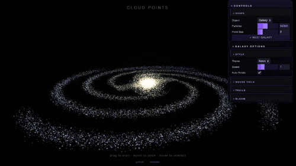
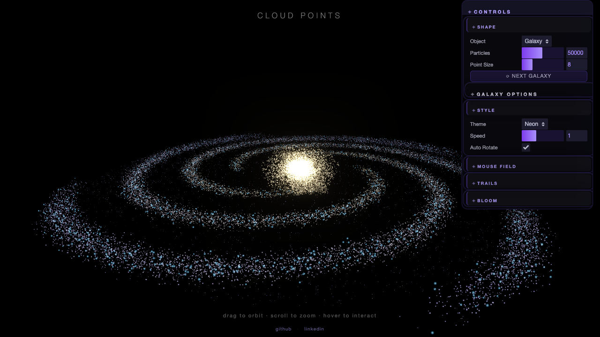

# Cloud Points Experiment

Interactive 3D particle visualization experiment using Three.js.



## Features

### 🌌 Real Galaxy Morphologies
- **Milky Way** - Barred spiral with 4 arms, warm golden core
- **Andromeda (M31)** - Grand design spiral inclined 77°, large bulge, 2 dwarf satellites
- **Sombrero (M104)** - Edge-on lenticular with massive bulge and dust lane
- **Whirlpool (M51)** - Two-armed spiral with companion galaxy connected by tidal bridge
- **Magellanic Cloud** - Irregular galaxy with HII star-forming regions

### ⚛️ Sacred Geometry Patterns
- Flower of Life
- Metatron's Cube
- Sri Yantra
- Merkaba (3D star tetrahedron)
- Seed of Life
- Vesica Piscis

### 🌍 Other Visualizations
- **Earth** - Real coastlines from Natural Earth 110m data, accurate continents and biomes
- **DNA** - Double helix structure
- **Jellyfish** - Organic bell with animated tentacles
- **Fractal Tree** - Recursive branching
- **Particle Waves** - Ocean-like wave surface
- **Geodesic** - Icosahedron wireframe
- **Morph** - Smooth torus-to-sphere transformation

### ✨ Interactive Features
- **Mouse Force Field** - Particles repel or attract from cursor
- **Post-Processing Effects** - Bloom glow and motion trails
- **Customizable Themes** - Neon, Warm, Cool, Mono, Aurora, Fire, Ocean
- **Mobile-Responsive** - Touch controls and adaptive UI

## Live Demo

🚀 **[View Demo](https://cloud-points-experiment.vercel.app)** _(after deployment)_

## Tech Stack

- **Three.js** v0.163.0 (WebGL rendering)
- **lil-gui** (interactive controls)
- **Pure JavaScript** (ES6 modules, no build tools)
- **CDN-based** (no npm dependencies)

## Local Development

```bash
# Option 1: Open directly in browser
open index.html

# Option 2: Serve with Python (recommended for full features)
python3 -m http.server 8000
# Then navigate to http://localhost:8000

# Option 3: Any other local server
npx serve .
```

**Note:** Camera and some ES6 module features work best when served via HTTP.

## Browser Compatibility

- Chrome 79+ ✓
- Firefox 68+ ✓
- Safari 12.1+ ✓
- Requires WebGL 2.0 support

## Screenshots


*Milky Way - Barred spiral galaxy with natural colors*

## Credits

Created by [Yuval Gabay](https://github.com/GuitaristForEver)

- [GitHub](https://github.com/GuitaristForEver)
- [LinkedIn](https://www.linkedin.com/in/yuval-gabay-68963253/)

## License

MIT
